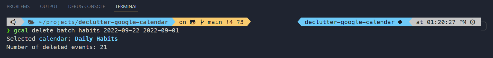
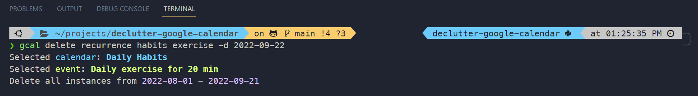

# Declutter Google Calendar


**CLI to batch delete multiple Google Calendar events 📆**

* Delete all events within a specific time period
* Delete past entries of a specific recurring event series 

---

**Documentation:** [Official Website](https://t-charura.github.io/declutter-google-calendar/)

**Source Code:** [Github](https://github.com/t-charura/declutter-google-calendar)

---

## About the Project


Did you ever want to declutter your Google Calendar? Or get rid of old and irrelevant calendar events?

You probably realised that neither the Google Calendar app nor the website offer the functionality to batch delete multiple events at once. After deleting more than 100 events from my calendar by hand, I created this CLI program to automate the process. 


### Build with
*  [Python](https://www.python.org/) 

*  [Google Api Python Client](https://github.com/googleapis/google-api-python-client)

*  [Typer](https://github.com/tiangolo/typer)

---

## Prerequisites

In order to connect to your Google Calendar you need to create a Google Cloud Platform Project, enable the Google Calendar API and download your credentials. Please have a look at the following guide on [how to setup your Google Workspace and get your Credentials](google_workspace_setup.md)

---

## Installation

### Using **Poetry** (recommended)

If you are not already a poetry user, have a look at the [official documentation](https://python-poetry.org/docs/) and install poetry for your operating system.

Next, execute the following commands to clone the project to your local machine via HTTPS or SSH, cd into the project, create a virtual environment based on the `pyproject.toml` and install the package to get access to the `gcal` command.

```console
$ git clone https://github.com/t-charura/declutter-google-calendar.git
$ cd declutter-google-calendar
$ poetry shell
$ poetry install
```

### Without **Poetry**

If you are not using poetry, you can still use the `pyproject.toml` to install the package (similar to using `setup.py` with a `requirements.txt`). I recommend that you create and activate a [virtual environment](https://docs.python.org/3/library/venv.html#creating-virtual-environments) before you start the process.

Next, execute the following commands to clone the project to your local machine via HTTPS or SSH, cd into the project and install the package using the `pyproject.toml`

```console
$ git clone https://github.com/t-charura/declutter-google-calendar.git
$ cd declutter-google-calendar
$ python -m pip install .
```

### Using **pip**
Coming soon ... 

---

## How to use

Now you should have access to the `gcal` command. 

Please run the following commmand to make sure that everything was installed correctly and to read about the CLI in more detail.

```console
$ gcal --help 
``` 
You will have access to the following subcommmands:

    delete              Interact with gcal's delete subcommands
    generate-token      Create a token to access your Google Calendar.
    get                 Interact with gcal's get subcommands
    remove-token        Delete your Token if it exists.

### Authentication

Before you can start decluttering your Calendar - you have to generate a token that gives you access to your Google Calendar. 
Please run the following command in the directory that stores your credentials. Make sure that your [credential file](#prerequisites) is named as follows: "credentials.json".

```console
$ gcal generate-token
```
In case your token has expired - remove it with:
```console
$ gcal remove-token
```
and generate a new one by running the command: `gcal generate-token` in the directory that stores your credentials.json file. See the [Prerequisites](#prerequisites) section if you do not have a credentials file yet.


### Decluttering


**Delete all events from a calendar within a specified time period.**
``` console
$ gcal delete batch [OPTIONS] CALENDAR_NAME MAX_DATE [MIN_DATE]
```
* `CALENDAR_NAME`: String to fuzzy match the calendar name.  [required]
* `MAX_DATE`: Delete all events prior to this date (yyyy-mm-dd).  [required]
* `[MIN_DATE]`: Delete all events up until this date (yyyy-mm-dd).


For example, if you want to delete all events from the calendar named "Daily Habits" between 2022-09-01 and 2022-09-22: 

``` console
$ gcal delete batch habits 2022-09-22 2022-09-01
```



If you do not provide the second date `MIN_DATE`, all events prior to the first date `MAX_DATE` will be deleted.

For more details and examples have a look at the [CLI Documentation](cli_documentation.md#gcal-delete-batch).

**Batch delete past instances of a recurring event.**
``` console
$ gcal delete recurrence [OPTIONS] CALENDAR_NAME EVENT_NAME
```
* `CALENDAR_NAME`: String to fuzzy match the calendar name.  [required]
* `EVENT_NAME`: String to fuzzy match the recurring event name.  [required]
* `-d, --date TEXT`: Delete all instances prior to this date (yyyy-mm-dd)

For example, if you want to delete all old recurring instances of the event "Daily exercise for 20 min" from the calendar named "Daily Habits" before the 22nd of September 2022:
``` console
$ gcal delete recurrence habits exercise -d 2022-09-22
```



In case you do not provide the date option, all instances prior to **today** will be deleted.

For more details and examples have a look at the [CLI Documentation](cli_documentation.md#gcal-delete-recurrence).

---

## Next Steps

- [ ] Publish on pypi.org
- [ ] Add other methods of authentication


---

## Licence

Distributed under the MIT License. See `LICENSE` for more information.

---

## Contact

**Email:** tendai.charura@gmail.com

**Github:** [t-charura](https://github.com/t-charura)
