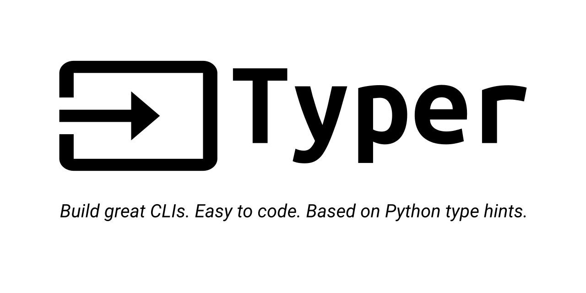

# Google Calendar CLI / Declutter Google Calendar


**CLI to batch delete multiple Google Calendar events 📆**

* Delete all events within a specific time period
* Delete past entries of a specific recurring event series 

---

**Documentation:** [Official Website](https://t-charura.github.io/gcal-cli/)

**Source Code:** [Github](https://github.com/t-charura/gcal-cli)

---

## About the Project


Did you ever want to declutter your Google Calendar? Or get rid of old and irrelevant calendar events?

You probably realised that neither the Google Calendar app nor the website offer the functionality to batch delete multiple events at once. After deleting more than 100 events from my calendar by hand, I created this CLI program to automate the process. 


### Build with
*  [Python](https://www.python.org/) 

*  [Google Api Python Client](https://github.com/googleapis/google-api-python-client)

*  [Typer](https://github.com/tiangolo/typer)

---

## Prerequisites

In order to connect the gcal-cli to your Google Calendar you need to create a Google Cloud Platform Project, enable the Google Calendar API and download your credentials. Please have a look at the following guide on [How to setup your Google Workspace](google_workspace_setup.md)

---

## Installation

### Using **Poetry** (recommended)

If you are not already a poetry user, have a look at the [official documentation](https://python-poetry.org/docs/) and install poetry for your operating system.

Next, execute the following commands to clone the project to your local machine via HTTPS or SSH, cd into the project, create a virtual environment based on the `pyproject.toml` and install the package to get access to the `gcal` command.

```console
$ git clone https://github.com/t-charura/gcal-cli.git
$ cd gcal-cli
$ poetry shell
$ poetry install
```

### Without using **Poetry**

If you are not using poetry, you can still use the `pyproject.toml` to install the package (similar to using `setup.py` with a `requirements.txt`). I recommend that you create and activate a [virtual environment](https://docs.python.org/3/library/venv.html#creating-virtual-environments) before you start the process.

Next, execute the following commands to clone the project to your local machine via HTTPS or SSH, cd into the project and install the package using the `pyproject.toml`

```console
$ git clone https://github.com/t-charura/gcal-cli.git
$ cd gcal-cli
$ python -m pip install .
```

### Using **pip**
Coming soon ... 

---

## How to use

Now you should have access to the ```gcal``` command.

Please run the following commmand to make sure that everything was installed correctly and to read about how to use the CLI in detail.
```console
$ gcal --help 
``` 


### Authentication

Before you can start decluttering your Calendar, you have to generate a token that lets you access your Google Calendar. 
Please run the following command in the directory that stores your credentials. Make sure that your credential file is named as follow: "credentials.json". 

```console
$ gcal generate-token
```

* Some information about "Ablauf Zeit des tokens" 
* delete Token and generate a new one 

### Batch delete events
* use description of --help commands to generate quick info here (describe basic and refer to --help command again)

Batch
```console
$ gcal delete batch
```
Recurrence
```console
$ gcal delete recurrence
```


---

## Next Steps

* [ ] Publish on pypi.org
* [ ] Add other methods of authentication

---

## Licence

Distributed under the MIT License. See `LICENSE` for more information.

---

## Contact

**Email:** tendai.charura@gmail.com

**Github:** [t-charura](https://github.com/t-charura)


---


## My Todos (not part of the readme)

* More descriptive package name -> gcal-cli - it is not a general CLI
    * declutter-gcal ?