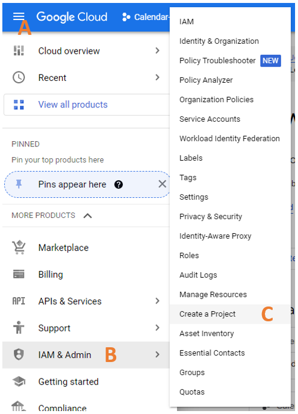
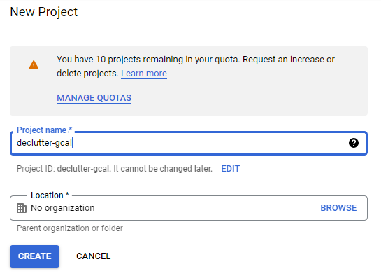
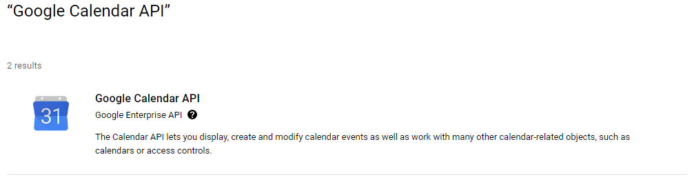
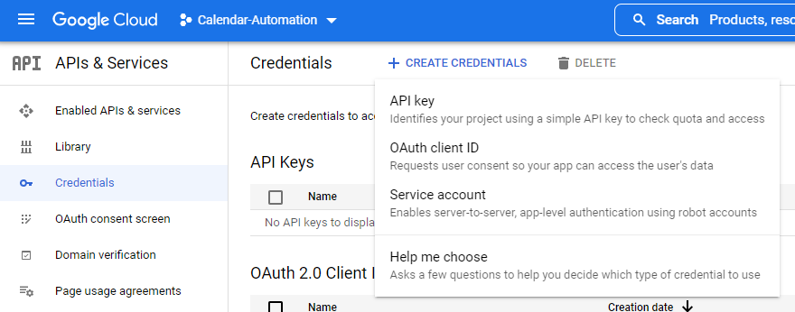
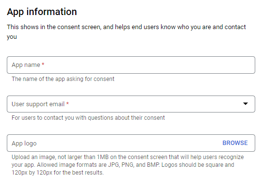

# Google Workspace Setup

## Create a Google Cloud Project

1. Open [https://console.cloud.google.com/](https://console.cloud.google.com/)
2. At the top-left, click ***Menu (A) > IAM & Admin (B) > Create a Project (C)***.

    

3. In the Project Name field, enter a descriptive name for your project and click `Create`

    

Reference: [https://developers.google.com/workspace/guides/create-project](https://developers.google.com/workspace/guides/create-project)

## Enable the Google Calendar API
1. Open [https://console.cloud.google.com/](https://console.cloud.google.com/)
2. At the top-left, click ***Menu > APIs & Services > Library***.
3. In the search field, enter the name `Google Calendar API` and press Enter.
4. In the list of search results, click on the Google Calendar API
    
    

5. Click ***Enable***

Reference: [https://developers.google.com/workspace/guides/enable-apis](https://developers.google.com/workspace/guides/enable-apis)

## Create & Download Credentials
1. Open [https://console.cloud.google.com/](https://console.cloud.google.com/)
2. At the top-left, click ***Menu > APIs & Services > Credentials***.
3. Click ***Create Credentials > OAuth client ID***.

    

    Before you can continue with 4. you probably have to "Configure the OAuth consent screen"

    1. Click ***CONFIGURE CONSENT SCREEN***  (if there is no such button, please continue with step 4.)
    2. Select ***External*** and click ***CREATE***
        * *OAuth consent screen* - under ***App information*** enter an App name in the field "App name" and add your Email in the field "User supportmail.com". 
        
            

        * *OAuth consent screen* - at the end of the page add your Email under ***Developer contact information*** in the field "Email addresses". Click ***SAVE AND CONTINUE***
        * *Scopes* - Click ***SAVE AND CONTINUE*** (not necessary to make any adjustments here)
        * *Test users* - Click ***ADD USERS*** and add your Email again. Click ***SAVE AND CONTINUE***

    3. Congratulations, you have configured the OAuth consent screen. Go back to the credentials page (step 2.) and click ***Create Credentials > OAuth client ID***. Now you can continue with step 4 below.

4. Click ***Application type > Desktop app***.
5. In the Name field, type a name for the credential. This name is only shown in the Google Cloud console.
6. Click ***Create***. The OAuth client created screen appears, showing your new Client ID and Client secret.
7. Click ***DOWNLOAD JSON***. A file is downloaded with a name similar to: `client_secret_...com.json`
8. Rename the downloaded file to `credentials.json`

Reference: [https://developers.google.com/workspace/guides/create-credentials#desktop-app](https://developers.google.com/workspace/guides/create-credentials#desktop-app)
